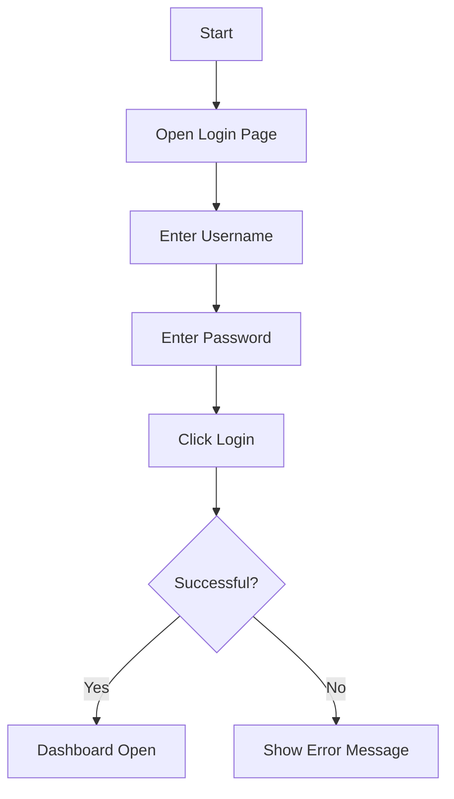

# 🤖 01 - AI for QA

## 📌 Overview

- AI helps QA engineers generate test ideas, write automation code, summarize bugs, and explain technical logs.
- Large Language Models (LLMs) are useful for accelerating manual and automation work.

## 🧠 LLM Basics

- LLM = Large Language Model.
- It predicts the next best token based on training data and instructions.
- Useful for:
  - generating test cases
  - writing automation code
  - summarizing bugs
  - explaining APIs and logs
  - creating SQL queries

## 🧪 Example Prompts for QA

- “Generate 20 test cases for login functionality with valid/invalid credentials.”
- “Create a regression test suite for CRUD APIs using Postman.”
- “Explain this Selenium failure and suggest fixes.”
- “Write a Cucumber scenario for checkout flow

## 🧩 Which Models Are Used Where?

### Quick comparison for QA work

| Task                                  | Good Model Choice                         | Why                                                            |
| ------------------------------------- | ----------------------------------------- | -------------------------------------------------------------- |
| Test case generation                  | GPT-4o / GPT-4.1 / Claude 3.5+            | Strong reasoning, structured output, good for QA scenarios     |
| Code generation and debugging         | GPT-4.1 / Claude 3.5+ / Kimi K2           | Strong coding support and helpful explanations                 |
| Bug summarization and root cause help | GPT-4o / Claude 3.5+ / Gemini 1.5+        | Good at reading logs and producing concise summaries           |
| Long context analysis                 | Gemini 1.5+ / Claude 3.5+ / Kimi          | Better for larger documents, specs, or long test reports       |
| Lightweight and budget tasks          | Llama 3.x / smaller GPT-compatible models | Useful when cost or speed matters more than maximum capability |

### Anthropic vs Kimi comparison

| Model family | Best for | QA fit | Notes |
| --- | --- | --- | --- |
| Anthropic models | careful reasoning, strong writing, code explanation | test planning, bug analysis, documentation | very good for detailed, structured QA prompts |
| Kimi models | multilingual support, long-context understanding, quick summarization | requirement review, log summarization, large document handling | strong when content volume or language variety matters |

### Detailed model comparison

| Model family              | Strengths                                                | Best for QA                                            | Limitations                                               |
| ------------------------- | -------------------------------------------------------- | ------------------------------------------------------ | --------------------------------------------------------- |
| GPT-4o / GPT-4.1          | Strong general reasoning, coding, and multimodal support | Test design, automation code, bug analysis             | Can be more expensive than smaller models                 |
| Claude 3.5+ / Claude 3.7+ | Excellent writing, careful reasoning, strong coding help | Test case writing, root cause analysis, documentation  | May need clearer prompts for very specific outputs        |
| Gemini 1.5+               | Strong long-context handling                             | Large requirements docs, long logs, big context review | Quality may vary by task type                             |
| Kimi models               | Strong multilingual and long-context support             | Summaries, research, large document understanding      | May need prompt tuning for structured QA outputs          |
| Llama 3.x                 | Lightweight and flexible                                 | Budget-friendly automation help and simple summaries   | Usually weaker for complex reasoning than top-tier models |

### Practical recommendation for QA teams

- Use GPT-4o / GPT-4.1 for daily QA assistant work.
- Use Claude for detailed documentation and careful reasoning.
- Use Gemini or Kimi when long context or multilingual support matters.
- Use Llama for cheaper or local experiments.

### Example prompt for model comparison

```text
Compare GPT-4.1, Claude 3.5+, Gemini 1.5+, and Kimi for QA test case generation. Provide a table with strengths, weaknesses, and best use cases.
```

## ⚙️ Prompting Tips

- Be specific: role, context, output format, constraints.
- Ask for examples.
- Ask for edge cases.
- Ask for both positive and negative scenarios.

Example:

```text
You are a QA engineer. Create 10 negative test cases for a password reset feature.
Output as a table with Test ID, Scenario, Steps, Expected Result, Priority.
```

## 🧰 AI Agents, Harnesses & Tools

- Agents can plan, execute tasks, and use tools.
- Examples:
  - browser automation agents
  - code-editing assistants
  - test generation assistants
- Useful in QA workflows for:
  - generating scripts
  - triaging bug reports
  - creating exploratory testing checklists

## 📊 Mermaid Diagrams

Mermaid is useful for documenting flows, test architecture, and systems.

Example:



## 👨‍💻 GitHub Copilot Basics

- Install GitHub Copilot extension in VS Code.
- Sign in with a GitHub account.
- Use inline code suggestions while typing.
- Use Copilot Chat for:
  - explaining code
  - generating tests
  - refactoring logic
  - writing documentation

Example workflow:

1. Open a Java or JavaScript file.
2. Type a comment such as “Write a Selenium test for login page”.
3. Review the suggestion.
4. Accept or edit the generated code.

Useful prompts:

```text
Explain this function in simple terms.
Write unit tests for this method.
Generate a Cucumber scenario for this feature.
Suggest improvements for this API test script.
```
